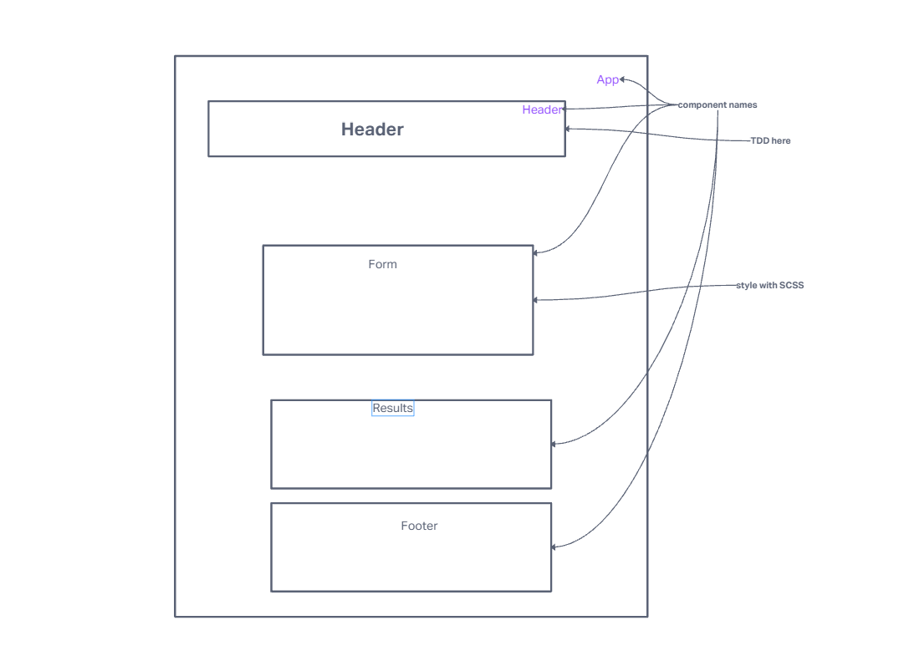

# Resty

## UML

## Process

- npx create-react-app appName
- npm i uuid sass
- copy over starter code in place of default src code
- turn all classes except App class into functions
- make sure to be passing props the right way so that it runs (in functions you no longer bring in props with this.props it is now an argument in the functions and is now just props)
